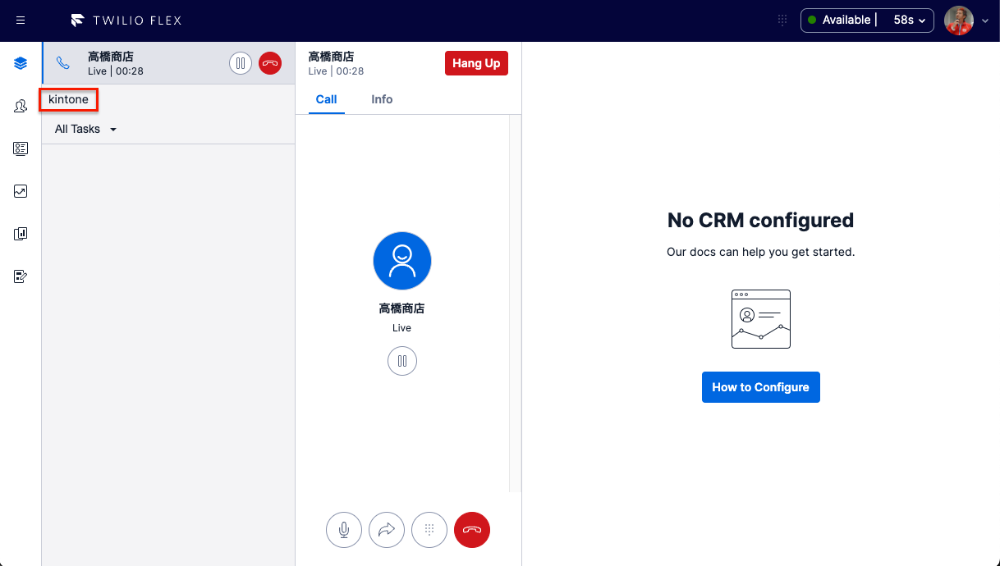
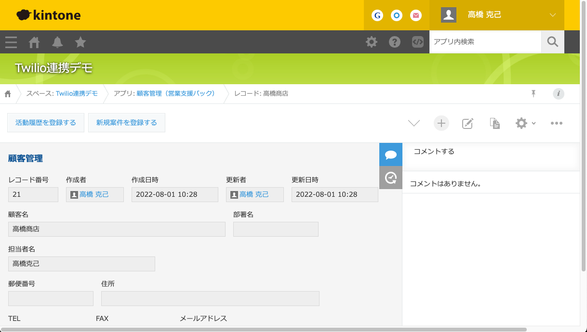
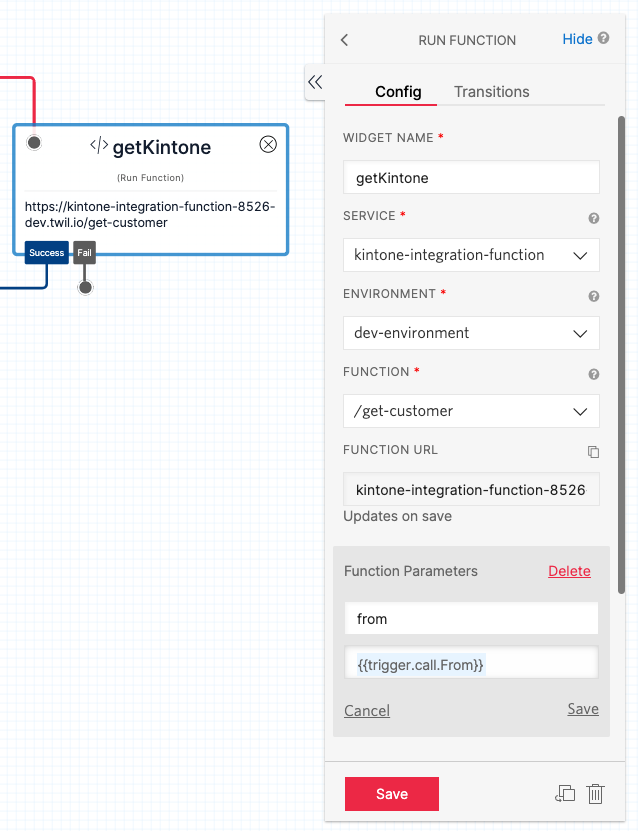
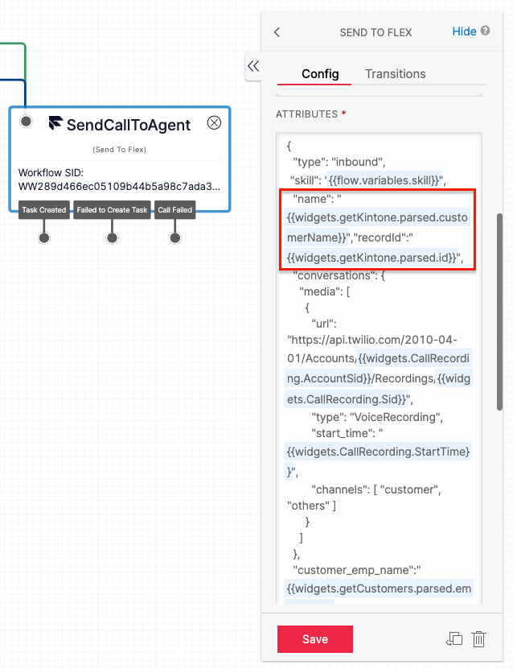

# kintone integration for Twilio Flex

Twilio Flex と kintone を連携させるプラグインです。

## 実行イメージ



Studio フロー内で、発信番号から kintone 上の顧客データを検索し、データが存在する場合は顧客名を表示させます。

さらに、TaskListItem コンポーネントの下に、`kintone`という文字のリンクが表示され、そこをクリックすると別タブで kintone の顧客アプリが開きます。



顧客アプリ側に登録が無い電話番号からの着信の場合は、kintone 側は顧客アプリの新規登録画面が表示されます。  
このとき、クリップボードに発信番号がコピーされているので、電話番号欄への記入が簡単になります。

## Flex UI のバージョン

本プラグインは、Flex UI 2.0 beta-2 で作成してありますが、Flex UI 1.32 でも動作することは確認されています。

## ファイル構成

```bash
.
├── README.md
├── build
│   ├── plugin-kintone-integration.js
│   ├── plugin-kintone-integration.js.LICENSE.txt
│   └── plugin-kintone-integration.js.map
├── functions
│   ├── assets
│   │   └── logo_kintone_mark_rgb.png
│   ├── functions
│   │   └── get-customer.js
│   ├── node_modules
│   ├── package-lock.json
│   ├── package.json
│   └── readmes
│       └── blank.md
├── jest.config.js
├── node_modules
├── package-lock.json
├── package.json
├── public
│   ├── appConfig.example.js
│   └── appConfig.js
├── src
│   ├── KintoneIntegrationPlugin.tsx
│   ├── components
│   │   └── CustomTaskItem
│   │       └── CustomTaskItem.tsx
│   └── index.ts
├── tsconfig.json
├── webpack.config.js
└── webpack.dev.js
```

functions フォルダには、Twilio Serverless の環境があり、Twilio Functions を使って、kintone から顧客情報を取得する`get-customer.js`が格納されています。  
Flex Plugin は、`src`フォルダの中に格納されています。

## 準備

kintone の準備に加えて、serverless 環境とプラグイン環境でそれぞれ準備が必要です。

### kintone

kintone 側では、顧客情報（電話番号と顧客名）が格納されているアプリを用意する必要があります。  
そのアプリの読み取り権限が付与されたトークンも生成しておいてください。

### serverless 環境

`functions/.env.sample`をコピーします。

```bash
cp functions/.env.sample functions/.env
```

コピーした`.env`ファイルを編集して、以下の変数を指定してください。

| Key                        | value                                                                  |
| :------------------------- | :--------------------------------------------------------------------- |
| KINTONE_SUB_DOMAIN         | kintone のサブドメイン名（<https://xxxxx.cybozu.com> の xxxxx の部分） |
| KINTONE_CUSTOMER_API_TOKEN | 顧客情報アプリで生成したトークン                                       |
| KINTONE_CUSTOMER_APP_ID    | 顧客情報アプリの ID（<https://xxxxx.cybozu.com/k/NN/> の NN の部分）   |
| KINTONE_NUMBER_FIELD_CODE  | アプリの電話番号フィールドのフィールドコード（例:TEL）                 |
| KINTONE_NAME_FIELD_CODE    | アプリの顧客名フィールドのフィールドコード（例:顧客名）                |

### プラグイン環境

`.env.sample`をコピーします。

```bash
cp .env.sample .env
```

コピーした`.env`ファイルを編集して、以下の変数を指定してください。

| Key                              | value                                                                |
| :------------------------------- | :------------------------------------------------------------------- |
| FLEX_APP_KINTONE_CUSTOMER_APP_ID | 顧客情報アプリの ID（<https://xxxxx.cybozu.com/k/NN/> の NN の部分） |

## デプロイ

デプロイも Serverless 環境とプラグイン環境でそれぞれ行う必要があります。

### serverless 環境のデプロイ

```bash
cd functions
npm install
npm run deploy
```

デプロイが成功したら、プラグイン環境に戻ります。

```bash
cd ..
```

### プラグイン環境のデプロイ

```bash
npm install
npm run deploy
```

プラグインについては、デプロイをした後でリリース作業も必要です。デプロイの最後に表示されたコマンドを実行するか、Flex 画面上からプラグインのリリース作業を行ってください。

## Studio Flow の設定

ここまでの設定が完了したら、最後に Studio フローを使って、kintone で取得したデータを Flex に渡していきます。  
作成が必要なウィジェットは 2 つです。

### RUN FUNCTION ウィジェット

`getCustomer`という名前で RUN FUNCTION ウィジェットを作成してください。



Function Parameters に、以下の Key/Value を指定してください。

| Key  | Value                 |
| :--- | :-------------------- |
| from | {{trigger.call.From}} |

大文字小文字を間違えないようにしてください。

### SEND FLEX ウィジェット

Flex に接続するウィジェットの Attributes に、以下のパラメータを入れてください。

| パラメータ名 | 値                                         |
| :----------- | :----------------------------------------- |
| name         | {{widgets.getKintone.parsed.customerName}} |
| recordId     | {{widgets.getKintone.parsed.id}}           |

パラメータ名、値はそれぞれダブルコーテーションで囲むのを忘れないようにしてください。



## ライセンス情報

本プログラムのライセンスは [MIT license](https://en.wikipedia.org/wiki/MIT_License) に準じます。
